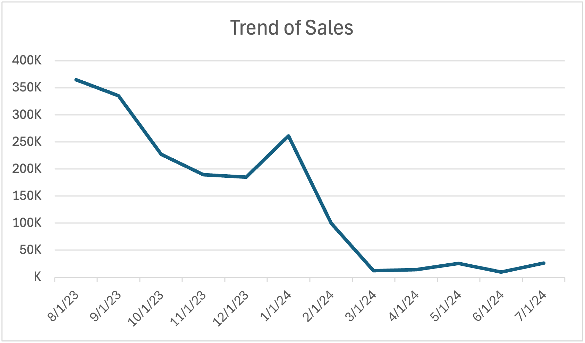
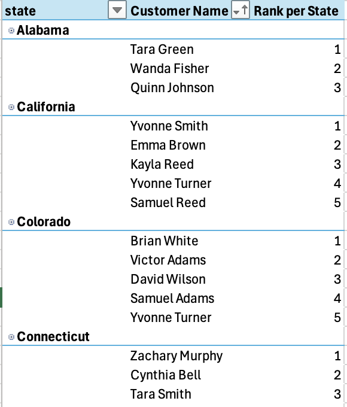
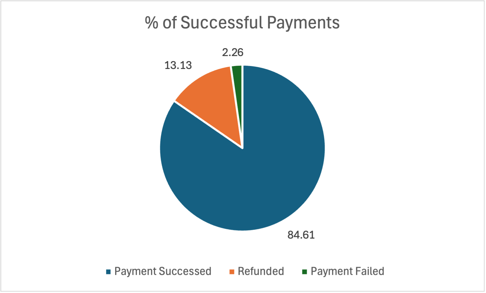

# Business Insights (Code and Results)

# 💰 Revenue & Sales Insights

## ✔ Top Selling Products

``` sql
-- Identifies the 10 highest-revenue products. [1]
SELECT
  order_items.product_id,
  products.product_name,
  SUM(quantity) AS total_quantity,
  ROUND(CAST(SUM(quantity*price_per_unit) AS NUMERIC), 2) AS total_sales

FROM order_items
  LEFT JOIN products
  ON products.product_id = order_items.product_id
GROUP BY order_items.product_id, products.product_name
ORDER BY total_sales DESC
LIMIT 10;
```


## ✔ Revenue by Category

```sql
SELECT
-- Analyzes revenue distribution across product categories. [2]
  category.category_id,
  category.category_name,
  SUM(total_sale) AS total_sales,
  ROUND((SUM(total_sale)/(SELECT SUM(total_sale) FROM order_items))*100, 2) AS percentage
FROM order_items
LEFT JOIN  products
  ON products.product_id = order_items.product_id
LEFT JOIN category
  ON category.category_id = products.category_id
GROUP BY category.category_id, category.category_name
ORDER BY total_sales DESC;
```


## ✔ Average Order Value (AOV)

```sql
-- Computes average order value for customers with more than 5 orders.  [3]
SELECT
  customers.customer_id,
  CONCAT(customers.first_name, ' ', customers.last_name) AS customer_name,
  ROUND(SUM(order_items.total_sale)/COUNT(orders.order_id), 2) AS average_order_value,
  COUNT(orders.order_id) AS total_orders
FROM order_items
JOIN orders ON orders.order_id = order_items.order_id
JOIN customers ON customers.customer_id = orders.customer_id

GROUP BY
  customers.customer_id
HAVING
  COUNT(orders.order_id) > 5
ORDER BY
  average_order_value DESC
LIMIT 10;
```

| Customer ID | Customer Name | Average Order Value | Total Orders |
| --- | --- | --- | --- |
| 189 | Yvonne Turner | 1,792.83 | 7 |
| 103 | Samuel Reed | 1,524.27 | 7 |
| 314 | Quinn Green | 1,366.81 | 6 |
| 203 | Xavier Green | 1,299.98 | 7 |
| 145 | Emma Scott | 1,276.42 | 7 |
| 330 | Hugo Smith | 1,238.31 | 6 |
| 530 | Gina Coleman | 1,196.65 | 6 |
| 275 | Ulysses Parker | 1,077.26 | 11 |
| 371 | Felix Lee | 1,048.31 | 6 |
| 465 | Rachel Turner | 1,031.86 | 8 |

## ✔ Monthly Sales Trend

```sql
-- Analyze monthly revenue changes, comparing current vs. last month’s sales. [4]
SELECT
  month,
  year,
  total_sales,
  LAG(total_sales, 1) OVER(ORDER BY year, month) AS last_month_sale

FROM (
  SELECT
    EXTRACT(MONTH FROM order_date) as month,
    EXTRACT(YEAR FROM order_date) as year,
    ROUND(SUM(order_items.total_sale::NUMERIC), 2) as total_sales
  FROM orders
    JOIN order_items
    ON orders.order_id = order_items.order_id
  WHERE order_date BETWEEN DATE '2023-08-01' AND DATE '2024-07-30'
  GROUP BY year, month
  ORDER BY year, month
) AS table_1;
```


## ✔ Revenue by Shipping Provider

```sql
--  Calculates total revenue handled by each shipping provider. [18]
SELECT
  s.shipping_providers as shipping_providers,
  COUNT(o.order_id) as total_orders,
  SUM(oi.total_sale) as total_sales,
  AVG(s.shipping_date - o.order_date) as ave_delivery_time

FROM shipping as s
JOIN orders as o
  ON s.order_id = o.order_id
JOIN order_items as oi
  ON oi.order_id = o.order_id

GROUP BY s.shipping_providers
ORDER BY total_orders DESC;
```


---

# 👥 Customer & Seller Insights

## ✔ Customer Lifetime Value (CLTV) → Rank customers by total lifetime spending. [7]

```sql
SELECT
  customers.customer_id,
  CONCAT(customers.first_name, ' ', customers.last_name) AS customer_name,
  SUM(total_sale) AS CLTV,
  DENSE_RANK() OVER(ORDER BY SUM(total_sale) DESC) AS cltv_rank
FROM order_items
JOIN orders ON orders.order_id = order_items.order_id
JOIN customers ON customers.customer_id = orders.customer_id

GROUP BY
  customers.customer_id
HAVING
  COUNT(orders.order_id) > 5
LIMIT 10
;
```
| customer_id | customer_name | cltv | cltv_rank |
| --- | --- | --- | --- |
| 554 | Yvonne Reed | 89029.09 | 1 |
| 616 | Mia Reed | 82350.18 | 2 |
| 711 | Fred Davis | 82179.17 | 3 |
| 591 | Quinn Davis | 79205.23 | 4 |
| 748 | Nathan Lee | 77136.98 | 5 |
| 718 | Henry Reed | 75825.21 | 6 |
| 625 | Wendy Reed | 75738.73 | 7 |
| 712 | Jack Johnson | 75017.15 | 8 |
| 669 | Zackary Davis | 74862.01 | 9 |
| 701 | Olivia Barnes | 74692.81 | 10 |
-- Shows top 10 results

## ✔ Top 5 Customers by Orders in Each State

```sql
-- Identifies top customers per state based on order count. [17]
WITH customers_ranked AS (
  SELECT
    CONCAT(c.first_name, ' ', c.last_name) as customer_name,
    c.state,
    COUNT(o.order_id) as total_orders,
    ROUND(SUM(oi.total_sale), 2) as total_sales,
    RANK() OVER(PARTITION BY c.state ORDER BY COUNT(o.order_id) DESC, SUM(oi.total_sale) DESC) as rank

  FROM customers as c
  JOIN orders as o
    ON o.customer_id = c.customer_id
  JOIN order_items as oi
    ON oi.order_id = o.order_id

  GROUP BY c.state, c.customer_id
  ORDER BY c.state, COUNT(o.order_id) DESC
)

SELECT *
FROM customers_ranked
WHERE rank <= 5;
```


## Customers with No Purchases 

```sql
-- Finds customers who have registered but never placed an order. [5]
SELECT *
FROM customers as c
LEFT JOIN orders as o
ON o.customer_id = c.customer_id
WHERE o.customer_id IS NULL
LIMIT 10;
```
| customer_id | first_name | last_name | state | order_id | order_date | customer_id (1) | seller_id | order_status |
| --- | --- | --- | --- | --- | --- | --- | --- | --- |
| 866 | Rachel | Scott | Texas |  |  |  |  |  |
| 887 | Kayla | Reed | Washington |  |  |  |  |  |
| 802 | Victor | Turner | Texas |  |  |  |  |  |
| 455 | Derek | Scott | New York |  |  |  |  |  |
| 850 | Frank | Turner | Texas |  |  |  |  |  |
| 801 | Rachel | Scott | Texas |  |  |  |  |  |
| 856 | Daniel | Davis | Texas |  |  |  |  |  |
| 807 | Patrick | Davis | Texas |  |  |  |  |  |
| 756 | Tara | Green | Texas |  |  |  |  |  |
| 872 | Henry | Smith | Utah |  |  |  |  |  |
-- Shows 1st 10 results

## Returning vs. new customers

```sql
-- Categorizes customers as either returning or new according to how many returns they've made. [16]
WITH initial_table AS(
  SELECT
    CONCAT(c.first_name, ' ', c.last_name) as full_name,
    COUNT(order_id) as total_orders,
    COUNT(CASE 
      WHEN order_status = 'Returned' THEN 1
      ELSE NULL
    END) AS total_returned

  FROM customers as c
  LEFT JOIN orders as o
    ON c.customer_id = o.customer_id

  GROUP BY full_name
)


SELECT *,
  CASE
    WHEN total_returned > 5 THEN 'returning'
    ELSE 'new'
  END AS customer_type
FROM initial_table
LIMIT 10;
```
| full_name | total_orders | total_returned | customer_type |
| --- | --- | --- | --- |
| Isla Turner | 78 | 78 | returning |
| Liam Davis | 21 | 0 | new |
| Emma Green | 7 | 0 | new |
| Patrick Reed | 95 | 0 | new |
| Carla Johnson | 80 | 0 | new |
| Rachel Brooks | 0 | 0 | new |
| Karen Mitchell | 0 | 0 | new |
| Isabella Davis | 300 | 0 | new |
| Rachel Lewis | 3 | 0 | new |
| Tina Evans | 3 | 0 | new |
-- Shows 1st 10 results

## ✔ Top Performing Sellers

```sql
-- Identifies top sellers based on total sales value and success rate. [11]
WITH top_sellers AS ( -- CTE: top 5 sellers based on revenue
  SELECT
    s.seller_id,
    s.seller_name,
    SUM(oi.total_sale) as total_sale
  FROM orders as o
  LEFT JOIN order_items as oi
    ON o.order_id = oi.order_id
  LEFT JOIN sellers as s
    ON s.seller_id = o.seller_id
  GROUP BY s.seller_id, s.seller_name
  ORDER BY total_sale DESC
  LIMIT 5
),

seller_reports AS ( -- CTE: to see different order status
  SELECT
    o.seller_id,
    ts.seller_name,
    o.order_status,
    COUNT(*) as order_count
  FROM orders as o
  JOIN top_sellers as ts
    ON o.seller_id = ts.seller_id
  WHERE
    o.order_status NOT IN ('Inprogress', 'Returned')
  GROUP BY o.seller_id, ts.seller_name, o.order_status
)

SELECT
  seller_id,
  seller_name,
  SUM(CASE WHEN order_status = 'Completed' THEN order_count ELSE 0 END) as completed_orders,
  SUM(CASE WHEN order_status = 'Cancelled' THEN order_count ELSE 0 END) as cancelled_orders,
  SUM(order_count) as total_orders,
  ROUND(SUM(CASE WHEN order_status = 'Completed' THEN order_count ELSE 0 END)::numeric/SUM(order_count)::numeric * 100, 2) as successful_order_percentage
FROM seller_reports
GROUP BY seller_id, seller_name;
```
| seller_id | seller_name | completed_orders | cancelled_orders | total_orders | successful_order_percentage |
| --- | --- | --- | --- | --- | --- |
| 3 | Tech Armor | 1751 | 36 | 1787 | 97.99 |
| 5 | Ailun | 1759 | 50 | 1809 | 97.24 |
| 4 | iSaddle | 1804 | 48 | 1852 | 97.41 |
| 1 | AmazonBasics | 1713 | 42 | 1755 | 97.61 |
| 2 | AnkerDirect | 1854 | 67 | 1921 | 96.51 |

## ✔ Inactive Sellers → Find sellers with no sales in the last 6 months.

```sql
-- Identifies sellers who haven’t made any sales in the last 6 months. [15]
SELECT
  s.seller_id,
  s.seller_name,
  MAX(o.order_date) AS last_sale_date,
  COALESCE(SUM(oi.total_sale), 0) AS total_sale

FROM sellers as s
LEFT JOIN orders as o
  ON s.seller_id = o.seller_id
JOIN order_items as oi
  ON o.order_id = oi.order_id

WHERE s.seller_id NOT IN (
  SELECT seller_id
  FROM orders
  WHERE order_date >= CURRENT_DATE - INTERVAL '6 months'
)

GROUP BY s.seller_id, s.seller_name
ORDER BY last_sale_date DESC
;
```
-- Showing the first 5
| seller_id | seller_name | last_sale_date | total_sale |
| --- | --- | --- | --- |
| 1 | AmazonBasics | 2024-07-30 | 1644364.36 |
| 41 | Moen | 2024-07-30 | 8855.28 |
| 12 | All-new Echo | 2024-07-30 | 110762.87 |
| 32 | T-fal | 2024-07-29 | 178963.43 |
| 26 | Cuisinart | 2024-07-29 | 156072.16 |

---

# 🚚 Operational & Inventory Insights

## ✔ Inventory Stock Alerts

```sql
-- Queries products with stock levels below a certain threshold (e.g., less than 10 units) [8]
SELECT
  i.inventory_id,
  p.product_name,
  i.stock AS current_stock,
  i.last_stock_date,
  i.warehouse_id
FROM inventory as i
  JOIN products as p
  ON p.product_id = i.product_id
WHERE stock < 10
;
```
| inventory_id | product_name | current_stock | last_stock_date | warehouse_id |
|-------------|--------------|---------------|----------------|--------------|
| 607 | Pet Water Fountain | 1 | 2022-08-01 | 1 |
| 609 | Pet Blanket | 7 | 2022-10-30 | 1 |
| 611 | Cat Food | 4 | 2023-07-25 | 1 |
| 612 | Dog Training Collar | 8 | 2022-05-04 | 1 |
| 614 | Remote Control Helicopter | 5 | 2023-07-30 | 1 |
-- Show first 5 results

## ✔ Shipping Delays

```sql
-- Identifies orders where the shipping date is later than 3 days after the order date [9]
SELECT
  c.*,
  o.*,
  s.shipping_providers,
  (s.shipping_date - o.order_date) AS days_took_to_ship
FROM orders as o
JOIN customers as c
  ON c.customer_id = o.customer_id
JOIN shipping as s
  ON s.order_id = o.order_id

WHERE
  (s.shipping_date - o.order_date) > 3
LIMIT 10;
```
| customer_id | first_name | last_name | state | order_id | order_date | customer_id (1) | seller_id | order_status | shipping_providers | days_took_to_ship |
|------------|------------|------------|--------|-----------|------------|----------------|------------|--------------|-------------------|-----------------|
| 188 | Ulysses | Green | California | 6035 | 2021-07-06 | 188 | 1 | Completed | fedex | 5 |
| 189 | Yvonne | Turner | California | 11560 | 2022-11-08 | 189 | 10 | Completed | fedex | 4 |
| 189 | Yvonne | Turner | California | 11416 | 2020-03-06 | 189 | 11 | Completed | fedex | 4 |
| 190 | David | Wilson | Colorado | 11768 | 2021-07-25 | 190 | 20 | Completed | fedex | 5 |
| 191 | Brian | White | Colorado | 14299 | 2022-04-03 | 191 | 4 | Completed | fedex | 5 |

-- Shows 1st 5 results

## ✔ Payment Success Rate

```sql
-- Calculates the percentage of successful payments across all orders [10]
SELECT
  payment_status,
  COUNT(*) as count,
  ROUND(COUNT(*)/(SELECT COUNT(*) FROM payments)::numeric * 100, 2) as status_percentage
FROM payments
GROUP BY payment_status;
```


## ✔ Orders Pending Shipment

```sql
-- Finds orders that have been paid but are still pending shipment [14]
SELECT
  c.customer_id,
  c.first_name,
  c.last_name,
  c.state,
  o.order_date,
  p.payment_date

FROM orders as o 
JOIN payments as p
  ON o.order_id = p.order_id
JOIN customers as c
  ON c.customer_id = o.customer_id

WHERE p.payment_status = 'Payment Successed'
  AND o.order_status = 'Inprogress'
LIMIT 10;
```
| customer_id | first_name | last_name | state | order_date | payment_date |
|------------|------------|------------|---------|------------|--------------|
| 50 | Yara | Smith | California | 2023-11-27 | 2023-11-27 |
| 50 | Yara | Smith | California | 2023-08-29 | 2023-08-29 |
| 50 | Yara | Smith | California | 2023-08-02 | 2023-08-02 |
| 50 | Yara | Smith | California | 2022-01-01 | 2022-01-01 |
| 50 | Yara | Smith | California | 2021-11-21 | 2021-11-21 |
-- Shows 1st 5 results

---

# 📈 Profitability & Trend Analysis

## ✔ Least-Selling Categories by State

```sql
-- Identifies the least-selling product category for each state. [6] 
WITH ranking_table AS (

SELECT
  c.state as state,
  ca.category_name,
  SUM(oi.total_sale) as total_sale,
  RANK () OVER(PARTITION BY c.state ORDER BY SUM(oi.total_sale) ASC) as rank

FROM orders as o
JOIN customers as c
  ON o.customer_id = c.customer_id
JOIN order_items as oi
  ON o.order_id = oi.order_id
JOIN products as p
  ON p.product_id = oi.product_id
JOIN category as ca
  ON ca.category_id = p.category_id

GROUP BY 1, 2

)

SELECT *
FROM ranking_table
WHERE rank = 1
ORDER BY total_sale
LIMIT 10;
```
| state | category_name | total_sale | rank |
|--------|--------------|------------|------|
| North Dakota | home & kitchen | 12.99 | 1 |
| Montana | home & kitchen | 12.99 | 1 |
| Illinois | home & kitchen | 16.99 | 1 |
| Hawaii | home & kitchen | 22.99 | 1 |
| New Hampshire | Sports & Outdoors | 29.98 | 1 |
| Georgia | home & kitchen | 29.99 | 1 |
| Connecticut | Toys & Games | 29.99 | 1 |
| New Mexico | home & kitchen | 38.97 | 1 |
| Massachusetts | Toys & Games | 38.97 | 1 |
| North Carolina | Sports & Outdoors | 39.98 | 1 |
-- Selects 1st 10 results

## ✔ Product Profit Margin 

```sql
-- Calculates the profit margin for each product (difference between price and cost of goods sold). Then ranks it. [12]
SELECT
  product_id,
  product_name,
  profit_margin,
  DENSE_RANK() OVER(ORDER BY profit_margin DESC) as profit_rank

FROM (
  SELECT
    p.product_id as product_id,
    p.product_name as product_name,
    (SUM((oi.total_sale - oi.quantity * p.cogs))/
      SUM(oi.total_sale))*100::numeric as profit_margin

  FROM order_items as oi
  JOIN products as p
    ON oi.product_id = p.product_id
  GROUP BY p.product_id, p.product_name
  ORDER BY profit_margin DESC
) as table_1

LIMIT 10;
```
| product_id | product_name | profit_margin | profit_rank |
|------------|--------------|--------------|-------------|
| 265 | Microsoft Surface Laptop 4 | 95.00 | 1 |
| 252 | HP Spectre x360 13 Laptop | 95.00 | 2 |
| 297 | Microsoft Surface Pro 6 | 95.00 | 3 |
| 187 | Bose Soundbar 700 | 95.00 | 4 |
| 114 | Microsoft Xbox Series X | 95.00 | 5 |
| 70 | Samsung 43-Inch 4K UHD Monitor | 95.00 | 6 |
| 253 | Sony WH-1000XM4 Noise Cancelling Headphones | 95.00 | 7 |
| 196 | Bose QuietComfort 45 | 95.00 | 8 |
| 199 | Jabra Elite 85t Wireless Earbuds | 95.00 | 9 |
| 112 | TP-Link Archer AX73 Wi-Fi 6 Router | 95.00 | 10 |
-- Selects 1st 10 results

## ✔ Most Returned Products 

```sql
-- Queries the top 10 products with the highest return rates. [13]
SELECT 
  p.product_id,
  p.product_name,
  ROUND((COUNT (*) FILTER (WHERE o.order_status = 'Returned')::numeric / COUNT (*)::numeric)*100, 2) as return_rate
FROM orders as o
JOIN order_items as oi
  ON o.order_id = oi.order_id
JOIN products as p
  ON p.product_id = oi.product_id

GROUP BY 1,2
ORDER BY return_rate DESC
LIMIT 10;
```
| product_id | product_name | return_rate |
|------------|--------------|-------------|
| 749 | Pet Travel Water Bottle | 100.00 |
| 743 | Dog Toothpaste | 66.67 |
| 745 | Cat Wand Toy | 66.67 |
| 570 | Yoga Mat | 50.00 |
| 301 | Canon EOS 77D Camera Kit | 42.86 |
| 523 | Vegetable Peeler | 40.00 |
| 355 | Women's Denim Jacket | 37.50 |
| 538 | Tea Canister Set | 37.50 |
| 343 | Women's Denim Skirt | 37.50 |
| 257 | Logitech MX Keys Mini | 36.36 |

## ✔ Products with the Highest Revenue Decline 

```sql
-- Computes top products with highest decreasing revenue ratio compared to last year(2022) and current_year(2023) [19]
SELECT
    p.product_id,
    p.product_name,
    ca.category_name,
    SUM(CASE
        WHEN EXTRACT(YEAR FROM o.order_date) = 2022
        THEN oi.total_sale
        ELSE 0 
        END) AS total_sale_2022,
    SUM(CASE
        WHEN EXTRACT(YEAR FROM o.order_date) = 2023
        THEN oi.total_sale
        ELSE 0 
        END) AS total_sale_2023,
    ROUND((SUM(CASE WHEN EXTRACT(YEAR FROM o.order_date) = 2023 THEN oi.total_sale ELSE 0 END)
        - SUM(CASE WHEN EXTRACT(YEAR FROM o.order_date) = 2022 THEN oi.total_sale ELSE 0 END))
        / NULLIF(SUM(CASE WHEN EXTRACT(YEAR FROM o.order_date) = 2022 THEN oi.total_sale ELSE 0 END), 0)
        * 100, 2) AS ratio
    

FROM products as p
JOIN  category as ca
  ON p.category_id = ca.category_id
JOIN order_items as oi
  ON p.product_id = oi.product_id
JOIN orders as o
  ON oi.order_id = o.order_id

GROUP BY p.product_id, p.product_name, ca.category_name
ORDER BY ratio ASC
LIMIT 10;
```

| product_id | product_name | category_name | total_sale_2022 | total_sale_2023 | ratio |
|------------|--------------|--------------|----------------|----------------|--------|
| 319 | Men's Casual Shorts | clothing | 209.93 | 0 | -100.00 |
| 329 | Men's Polo Shirt | clothing | 195.93 | 0 | -100.00 |
| 314 | Men's Sports Watch | clothing | 269.97 | 0 | -100.00 |
| 288 | Logitech C922 Pro Streaming Webcam | electronics | 79.99 | 0 | -100.00 |
| 258 | Sony XBR-65A8H OLED TV | electronics | 2499.99 | 0 | -100.00 |
| 271 | Canon RF 24-105mm f/4L IS USM Lens | electronics | 15599.88 | 0 | -100.00 |
| 282 | Logitech G502 Lightspeed Wireless Mouse | electronics | 559.93 | 0 | -100.00 |
| 277 | Razer Viper V2 Pro | electronics | 299.98 | 0 | -100.00 |
| 284 | Razer BlackWidow V3 Gaming Keyboard | electronics | 539.97 | 0 | -100.00 |
| 335 | Women's Trench Coat | clothing | 479.94 | 0 | -100.00 |
-- Shows 1st 10 results

# 🔄 Automated Inventory Management (Stored Procedure)

```sql
Store Procedure
-- This function handles the process of adding a sales transaction. It checks product availability, inserts order details, and updates inventory, and notifies the user of transaction status.

CREATE OR REPLACE FUNCTION add_sales(
    p_order_id INT,
    p_customer_id INT,
    p_seller_id INT,
    p_order_item_id INT,
    p_product_id INT,
    p_quantity INT
)
RETURNS VOID
LANGUAGE plpgsql
AS $$

DECLARE
    v_count INT;
    v_price FLOAT;
    v_product VARCHAR(50);

BEGIN
    -- Fetch product name and price
    SELECT price, product_name 
    INTO v_price, v_product 
    FROM products 
    WHERE product_id = p_product_id; 

    -- Check stock and product availability
    SELECT COUNT(*) 
    INTO v_count 
    FROM inventory
    WHERE product_id = p_product_id
    AND stock >= p_quantity;
    
    IF v_count > 0 THEN
        -- Insert into orders
        INSERT INTO orders(order_id, order_date, customer_id, seller_id)
        VALUES (p_order_id, CURRENT_DATE, p_customer_id, p_seller_id);

        -- Insert into order items
        INSERT INTO order_items(order_item_id, order_id, product_id, quantity, price_per_unit, total_sale)
        VALUES (p_order_item_id, p_order_id, p_product_id, p_quantity, v_price, v_price * p_quantity);

        -- Update inventory
        UPDATE inventory
        SET stock = stock - p_quantity
        WHERE product_id = p_product_id;

        RAISE NOTICE 'Thank you for your purchase. Your order for % is confirmed.', v_product;
    
    ELSE
        RAISE NOTICE 'Thank you for your information. The product % is not available at the moment.', v_product;
    
    END IF;
    
END;
$$;

-- Function Tests
SELECT add_sales(25000, 2, 5, 25001, 1, 40);
SELECT add_sales(25002, 4, 7, 25003, 3, 15);
SELECT add_sales(25001, 3, 6, 25002, 2, 20);
```