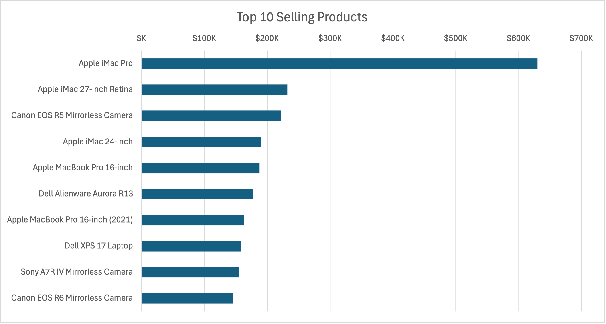
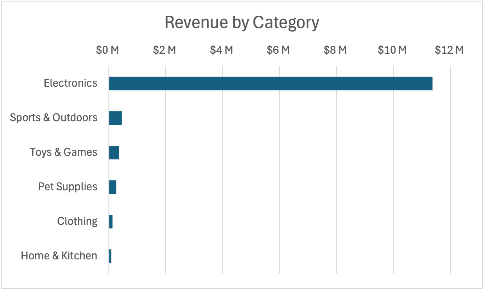

# Advanced SQL Business Insights for E-Commerce
---

# Project Description

This project showcases a comprehensive SQL-driven analysis for an e-commerce business, simulating real-world business problem-solving through advanced SQL queries.

Through window functions, joins, CTEs, subqueries, and aggregations, the project explores key business insights, identifying sales trends, customer behaviors, operational inefficiencies, and revenue opportunities. Additionally, the project includes stock management automation through stored procedures.

## Purpose of the Project

1. For Business Executives: Understand revenue trends, customer behaviors, seller performance, and shipping efficiency to optimize business strategy.

2. For Operations & Inventory Teams: Identify stock shortages, delayed shipments, and return patterns to streamline supply chain management.

3. For Data Analysts: Demonstrate the use of SQL for real-world business decision-making, including aggregations, ranking, trend analysis, and automated inventory tracking.

## The Dataset

This dataset captures key aspects of an online retail store, similar to Amazon, encompassing customers, orders, products, inventory, and sellers. It provides a comprehensive foundation for analyzing sales trends, customer behavior, inventory management, and seller performance.

🗂️ **[Datasets](/datasets/)**

## SQL Code & Queries

The complete SQL scripts for business insights, analytical queries, and stored procedures are available here:

📜 **[SQL Queries](/Business_Insights_Code_and_Results.md)**

## Table of Contents
1. [Revenue & Sales Insights](#1-revenue--sales-insights)
2. [Customer & Seller Insights](#2-customer--seller-insights)
3. [Operational & Inventory Insights](#3-operational--inventory-insights)
4. [4Profitability & Trend Analysis](#4-profitability--trend-analysis)
5. [Automated Inventory Management (Stored Procedure)](#5-automated-inventory-management-stored-procedure)

---


# 1. Revenue & Sales Insights

### ✔ Top Selling Products

``` sql
-- Identifies the 10 highest-revenue products. [1]
SELECT
  order_items.product_id,
  products.product_name,
  SUM(quantity) AS total_quantity,
  ROUND(CAST(SUM(quantity*price_per_unit) AS NUMERIC), 2) AS total_sales

FROM order_items
  LEFT JOIN products
  ON products.product_id = order_items.product_id
GROUP BY order_items.product_id, products.product_name
ORDER BY total_sales DESC
LIMIT 10;
```


The highest-grossing products are largely tech-related, with Apple devices like iMacs and MacBook Pros leading the market. With Dell following close behind for laptops. Cameras from Canon and Sony also contribute significantly to revenue, highlighting the dominance of high-end electronics.

### ✔ Revenue by Category

```sql
SELECT
-- Analyzes revenue distribution across product categories. [2]
  category.category_id,
  category.category_name,
  SUM(total_sale) AS total_sales,
  ROUND((SUM(total_sale)/(SELECT SUM(total_sale) FROM order_items))*100, 2) AS percentage
FROM order_items
LEFT JOIN  products
  ON products.product_id = order_items.product_id
LEFT JOIN category
  ON category.category_id = products.category_id
GROUP BY category.category_id, category.category_name
ORDER BY total_sales DESC;
```


Electronics generate the highest revenue, contributing a significant percentage of total sales. This emphasizes consumer preference for high-value, durable goods.

### ✔ Revenue by Shipping Provider

```sql
--  Calculates total revenue handled by each shipping provider. [18]
SELECT
  s.shipping_providers as shipping_providers,
  COUNT(o.order_id) as total_orders,
  SUM(oi.total_sale) as total_sales,
  AVG(s.shipping_date - o.order_date) as ave_delivery_time

FROM shipping as s
JOIN orders as o
  ON s.order_id = o.order_id
JOIN order_items as oi
  ON oi.order_id = o.order_id

GROUP BY s.shipping_providers
ORDER BY total_orders DESC;
```


FedEx dominates shipping volume and revenue, handling the majority of orders. However, DHL shows competitive delivery speeds, which may be appealing to customers prioritizing quick fulfillment.


## 2. Customer & Seller Insights

### ✔ Customer Lifetime Value (CLTV) → Rank customers by total lifetime spending. [7]

```sql
SELECT
  customers.customer_id,
  CONCAT(customers.first_name, ' ', customers.last_name) AS customer_name,
  SUM(total_sale) AS CLTV,
  DENSE_RANK() OVER(ORDER BY SUM(total_sale) DESC) AS cltv_rank
FROM order_items
JOIN orders ON orders.order_id = order_items.order_id
JOIN customers ON customers.customer_id = orders.customer_id

GROUP BY
  customers.customer_id
HAVING
  COUNT(orders.order_id) > 5
LIMIT 10
;
```
| customer_id | customer_name | cltv | cltv_rank |
| --- | --- | --- | --- |
| 554 | Yvonne Reed | 89029.09 | 1 |
| 616 | Mia Reed | 82350.18 | 2 |
| 711 | Fred Davis | 82179.17 | 3 |
| 591 | Quinn Davis | 79205.23 | 4 |
| 748 | Nathan Lee | 77136.98 | 5 |
| 718 | Henry Reed | 75825.21 | 6 |
| 625 | Wendy Reed | 75738.73 | 7 |
| 712 | Jack Johnson | 75017.15 | 8 |
| 669 | Zackary Davis | 74862.01 | 9 |
| 701 | Olivia Barnes | 74692.81 | 10 |
-- Shows top 10 results

This data provides the highest-spending customers. Retention strategies, such as personalized discounts or premium service offerings, could be leveraged to maintain these relationships.

### ✔ Top Performing Sellers

```sql
-- Identifies top sellers based on total sales value and success rate. [11]
WITH top_sellers AS ( -- CTE: top 5 sellers based on revenue
  SELECT
    s.seller_id,
    s.seller_name,
    SUM(oi.total_sale) as total_sale
  FROM orders as o
  LEFT JOIN order_items as oi
    ON o.order_id = oi.order_id
  LEFT JOIN sellers as s
    ON s.seller_id = o.seller_id
  GROUP BY s.seller_id, s.seller_name
  ORDER BY total_sale DESC
  LIMIT 5
),

seller_reports AS ( -- CTE: to see different order status
  SELECT
    o.seller_id,
    ts.seller_name,
    o.order_status,
    COUNT(*) as order_count
  FROM orders as o
  JOIN top_sellers as ts
    ON o.seller_id = ts.seller_id
  WHERE
    o.order_status NOT IN ('Inprogress', 'Returned')
  GROUP BY o.seller_id, ts.seller_name, o.order_status
)

SELECT
  seller_id,
  seller_name,
  SUM(CASE WHEN order_status = 'Completed' THEN order_count ELSE 0 END) as completed_orders,
  SUM(CASE WHEN order_status = 'Cancelled' THEN order_count ELSE 0 END) as cancelled_orders,
  SUM(order_count) as total_orders,
  ROUND(SUM(CASE WHEN order_status = 'Completed' THEN order_count ELSE 0 END)::numeric/SUM(order_count)::numeric * 100, 2) as successful_order_percentage
FROM seller_reports
GROUP BY seller_id, seller_name;
```
| seller_id | seller_name | completed_orders | cancelled_orders | total_orders | successful_order_percentage |
| --- | --- | --- | --- | --- | --- |
| 3 | Tech Armor | 1751 | 36 | 1787 | 97.99 |
| 5 | Ailun | 1759 | 50 | 1809 | 97.24 |
| 4 | iSaddle | 1804 | 48 | 1852 | 97.41 |
| 1 | AmazonBasics | 1713 | 42 | 1755 | 97.61 |
| 2 | AnkerDirect | 1854 | 67 | 1921 | 96.51 |

Leading sellers maintain a high success rate, with over 95% of orders completed successfully. Ensuring strong partnerships with these high-performing sellers can sustain marketplace credibility.

## 3. Operational & Inventory Insights

### ✔ Inventory Stock Alerts

```sql
-- Queries products with stock levels below a certain threshold (e.g., less than 10 units) [8]
SELECT
  i.inventory_id,
  p.product_name,
  i.stock AS current_stock,
  i.last_stock_date,
  i.warehouse_id
FROM inventory as i
  JOIN products as p
  ON p.product_id = i.product_id
WHERE stock < 10
;
```
| inventory_id | product_name | current_stock | last_stock_date | warehouse_id |
|-------------|--------------|---------------|----------------|--------------|
| 607 | Pet Water Fountain | 1 | 2022-08-01 | 1 |
| 609 | Pet Blanket | 7 | 2022-10-30 | 1 |
| 611 | Cat Food | 4 | 2023-07-25 | 1 |
| 612 | Dog Training Collar | 8 | 2022-05-04 | 1 |
| 614 | Remote Control Helicopter | 5 | 2023-07-30 | 1 |
-- Show first 5 results

Certain products have dangerously low stock levels, suggesting potential supply chain bottlenecks. Optimizing restocking schedules could prevent lost sales opportunities.

### ✔ Shipping Delays

```sql
-- Identifies orders where the shipping date is later than 3 days after the order date [9]
SELECT
  c.*,
  o.*,
  s.shipping_providers,
  (s.shipping_date - o.order_date) AS days_took_to_ship
FROM orders as o
JOIN customers as c
  ON c.customer_id = o.customer_id
JOIN shipping as s
  ON s.order_id = o.order_id

WHERE
  (s.shipping_date - o.order_date) > 3
LIMIT 10;
```
| customer_id | first_name | last_name | state | order_id | order_date | customer_id (1) | seller_id | order_status | shipping_providers | days_took_to_ship |
|------------|------------|------------|--------|-----------|------------|----------------|------------|--------------|-------------------|-----------------|
| 188 | Ulysses | Green | California | 6035 | 2021-07-06 | 188 | 1 | Completed | fedex | 5 |
| 189 | Yvonne | Turner | California | 11560 | 2022-11-08 | 189 | 10 | Completed | fedex | 4 |
| 189 | Yvonne | Turner | California | 11416 | 2020-03-06 | 189 | 11 | Completed | fedex | 4 |
| 190 | David | Wilson | Colorado | 11768 | 2021-07-25 | 190 | 20 | Completed | fedex | 5 |
| 191 | Brian | White | Colorado | 14299 | 2022-04-03 | 191 | 4 | Completed | fedex | 5 |

Orders exceeding the standard three-day shipping period indicate areas where logistics efficiency can be improved. Addressing these delays through better forecasting and supply chain optimizations may enhance customer satisfaction.

## 4. Profitability & Trend Analysis

### ✔ Product Profit Margin 

```sql
-- Calculates the profit margin for each product (difference between price and cost of goods sold). Then ranks it. [12]
SELECT
  product_id,
  product_name,
  profit_margin,
  DENSE_RANK() OVER(ORDER BY profit_margin DESC) as profit_rank

FROM (
  SELECT
    p.product_id as product_id,
    p.product_name as product_name,
    (SUM((oi.total_sale - oi.quantity * p.cogs))/
      SUM(oi.total_sale))*100::numeric as profit_margin

  FROM order_items as oi
  JOIN products as p
    ON oi.product_id = p.product_id
  GROUP BY p.product_id, p.product_name
  ORDER BY profit_margin DESC
) as table_1

LIMIT 10;
```
| product_id | product_name | profit_margin | profit_rank |
|------------|--------------|--------------|-------------|
| 265 | Microsoft Surface Laptop 4 | 95.00 | 1 |
| 252 | HP Spectre x360 13 Laptop | 95.00 | 2 |
| 297 | Microsoft Surface Pro 6 | 95.00 | 3 |
| 187 | Bose Soundbar 700 | 95.00 | 4 |
| 114 | Microsoft Xbox Series X | 95.00 | 5 |
| 70 | Samsung 43-Inch 4K UHD Monitor | 95.00 | 6 |
| 253 | Sony WH-1000XM4 Noise Cancelling Headphones | 95.00 | 7 |
| 196 | Bose QuietComfort 45 | 95.00 | 8 |
| 199 | Jabra Elite 85t Wireless Earbuds | 95.00 | 9 |
| 112 | TP-Link Archer AX73 Wi-Fi 6 Router | 95.00 | 10 |
-- Selects 1st 10 results

High-margin products like Microsoft Surface laptops and gaming peripherals drive profitability. Prioritizing marketing efforts for these products could maximize profit margins.

### ✔ Products with the Highest Revenue Decline 

```sql
-- Computes top products with highest decreasing revenue ratio compared to last year(2022) and current_year(2023) [19]
SELECT
    p.product_id,
    p.product_name,
    ca.category_name,
    SUM(CASE
        WHEN EXTRACT(YEAR FROM o.order_date) = 2022
        THEN oi.total_sale
        ELSE 0 
        END) AS total_sale_2022,
    SUM(CASE
        WHEN EXTRACT(YEAR FROM o.order_date) = 2023
        THEN oi.total_sale
        ELSE 0 
        END) AS total_sale_2023,
    ROUND((SUM(CASE WHEN EXTRACT(YEAR FROM o.order_date) = 2023 THEN oi.total_sale ELSE 0 END)
        - SUM(CASE WHEN EXTRACT(YEAR FROM o.order_date) = 2022 THEN oi.total_sale ELSE 0 END))
        / NULLIF(SUM(CASE WHEN EXTRACT(YEAR FROM o.order_date) = 2022 THEN oi.total_sale ELSE 0 END), 0)
        * 100, 2) AS ratio
    

FROM products as p
JOIN  category as ca
  ON p.category_id = ca.category_id
JOIN order_items as oi
  ON p.product_id = oi.product_id
JOIN orders as o
  ON oi.order_id = o.order_id

GROUP BY p.product_id, p.product_name, ca.category_name
ORDER BY ratio ASC
LIMIT 10;
```

| product_id | product_name | category_name | total_sale_2022 | total_sale_2023 | ratio |
|------------|--------------|--------------|----------------|----------------|--------|
| 319 | Men's Casual Shorts | clothing | 209.93 | 0 | -100.00 |
| 329 | Men's Polo Shirt | clothing | 195.93 | 0 | -100.00 |
| 314 | Men's Sports Watch | clothing | 269.97 | 0 | -100.00 |
| 288 | Logitech C922 Pro Streaming Webcam | electronics | 79.99 | 0 | -100.00 |
| 258 | Sony XBR-65A8H OLED TV | electronics | 2499.99 | 0 | -100.00 |
| 271 | Canon RF 24-105mm f/4L IS USM Lens | electronics | 15599.88 | 0 | -100.00 |
| 282 | Logitech G502 Lightspeed Wireless Mouse | electronics | 559.93 | 0 | -100.00 |
| 277 | Razer Viper V2 Pro | electronics | 299.98 | 0 | -100.00 |
| 284 | Razer BlackWidow V3 Gaming Keyboard | electronics | 539.97 | 0 | -100.00 |
| 335 | Women's Trench Coat | clothing | 479.94 | 0 | -100.00 |
-- Shows 1st 10 results

Certain electronics and clothing items have seen significant revenue drops year-over-year. Investigating market trends and adjusting product offerings accordingly may help counteract these declines.

---

## 5. Automated Inventory Management (Stored Procedure)

The Automated Inventory Management stored procedure ensures real-time stock updates whenever a sale is processed. This function automatically checks product availability, records transactions, and updates inventory levels accordingly. If stock is insufficient, it prevents the sale and notifies the user. This process minimizes manual stock adjustments, improves inventory accuracy, and helps businesses maintain an efficient supply chain by reducing instances of overselling or stockouts.

```sql
-- This function creates a stored procedure that automatically reduces inventory levels when a sale is made.

CREATE OR REPLACE FUNCTION add_sales(
    p_order_id INT,
    p_customer_id INT,
    p_seller_id INT,
    p_order_item_id INT,
    p_product_id INT,
    p_quantity INT
)
RETURNS VOID
LANGUAGE plpgsql
AS $$

DECLARE
    v_count INT;
    v_price FLOAT;
    v_product VARCHAR(50);

BEGIN
    -- Fetch product name and price
    SELECT price, product_name 
    INTO v_price, v_product 
    FROM products 
    WHERE product_id = p_product_id; 

    -- Check stock and product availability
    SELECT COUNT(*) 
    INTO v_count 
    FROM inventory
    WHERE product_id = p_product_id
    AND stock >= p_quantity;
    
    IF v_count > 0 THEN
        -- Insert into orders
        INSERT INTO orders(order_id, order_date, customer_id, seller_id)
        VALUES (p_order_id, CURRENT_DATE, p_customer_id, p_seller_id);

        -- Insert into order items
        INSERT INTO order_items(order_item_id, order_id, product_id, quantity, price_per_unit, total_sale)
        VALUES (p_order_item_id, p_order_id, p_product_id, p_quantity, v_price, v_price * p_quantity);

        -- Update inventory
        UPDATE inventory
        SET stock = stock - p_quantity
        WHERE product_id = p_product_id;

        RAISE NOTICE 'Thank you for your purchase. Your order for % is confirmed.', v_product;
    
    ELSE
        RAISE NOTICE 'Thank you for your information. The product % is not available at the moment.', v_product;
    
    END IF;
    
END;
$$;

-- Function Tests
SELECT add_sales(25000, 2, 5, 25001, 1, 40);
SELECT add_sales(25002, 4, 7, 25003, 3, 15);
SELECT add_sales(25001, 3, 6, 25002, 2, 20);
```

---

## Key Takeaways from the Project

### Revenue Optimization
- Electronics dominate sales, contributing the highest revenue share, with Apple products leading the market.
- Product profitability varies, with some high-selling items offering lower margins while niche products provide higher profits.
- Shipping providers impact revenue, as FedEx handles the most orders, while DHL offers competitive delivery times.
- Declining product sales indicate changing customer demand, emphasizing the need for data-driven restocking and marketing strategies.
  
### Customer & Seller Performance
- High-value customers drive revenue, with the top customers spending significantly more than average.
- Customer Lifetime Value (CLTV) rankings reveal opportunities for personalized marketing strategies to retain high-spending buyers.
- Top-performing sellers maintain high success rates, completing over 95% of orders successfully, emphasizing the value of reliable sellers in marketplace sustainability.

### Operational Improvements
- Stock shortages impact fulfillment, as several products fall below critical inventory levels, highlighting the need for better restocking schedules.
- Shipping delays exceed the expected three-day delivery window, indicating areas where logistics efficiency can be improved to enhance customer satisfaction.
- Unfulfilled orders persist, as some remain in a pending state despite being paid for, signaling operational bottlenecks in warehouse management.

### Profitability Insights
- Products with the highest profit margins include premium tech and gaming accessories, which businesses can prioritize for marketing and inventory expansion.
- Low-margin and declining sales products indicate shifting consumer preferences, requiring strategic discounts or removal from inventory.
- Storewide revenue trends highlight the importance of product lifecycle monitoring, ensuring businesses capitalize on high-demand items before interest declines.

### Automation & Scalability
- The stored procedure automates stock updates, preventing manual errors and ensuring inventory reflects actual sales in real-time.
- Automated sales tracking improves transaction efficiency, reducing the risk of overstocking or selling unavailable products.
- Data-driven decision-making becomes easier with SQL-driven automation, allowing companies to focus on scaling operations while ensuring inventory accuracy.

---

## About the Author and Tools Used

This project was created by Leigh Auza, using a dataset sourced from Zero Analyst. The analysis and insights were developed through SQL queries, executed and managed with pgAdmin4, and refined using VSCode. Excel was utilized for data visualization, ensuring clear and effective representation of key business trends. Additionally, ChatGPT Advanced Analytics enhanced insights and data interpretation.